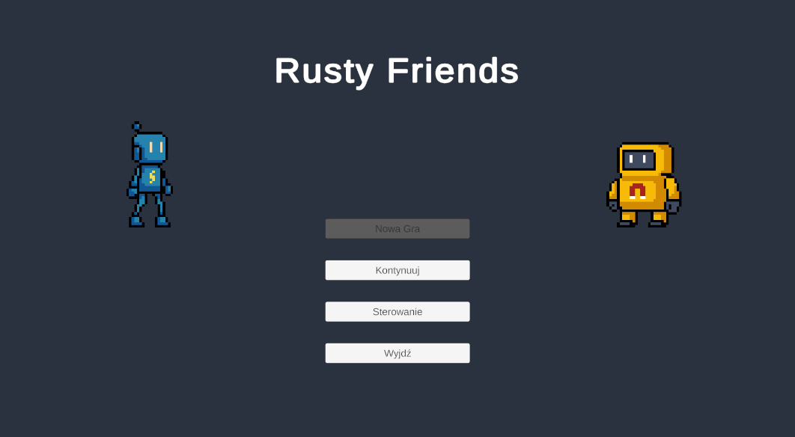
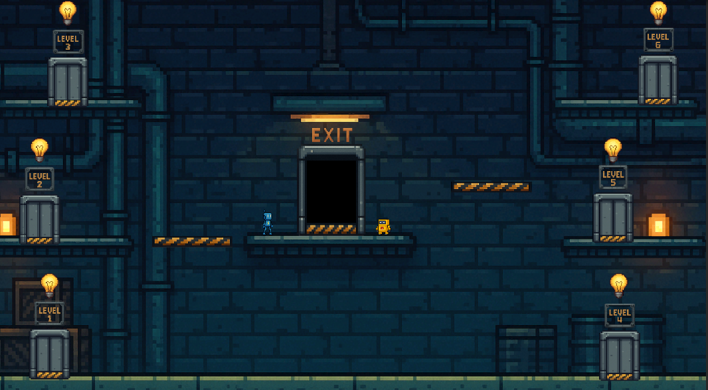
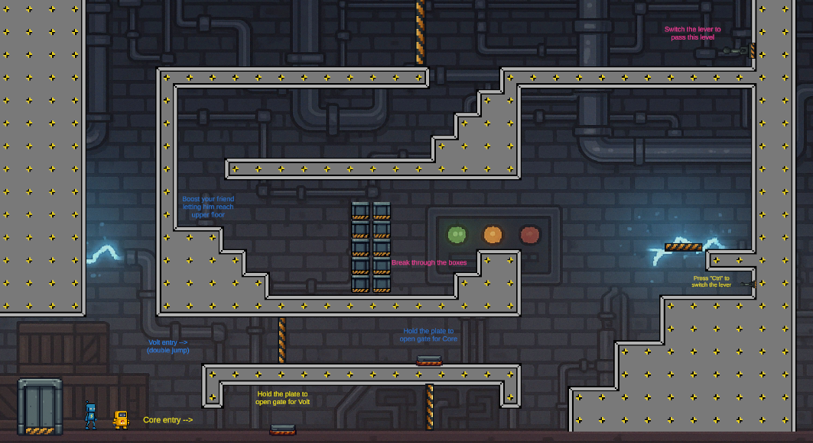
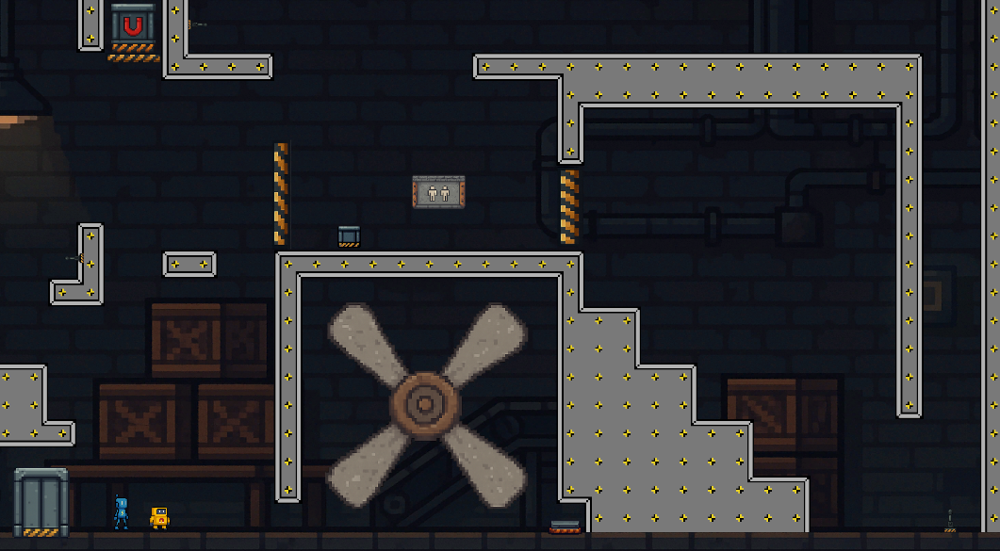
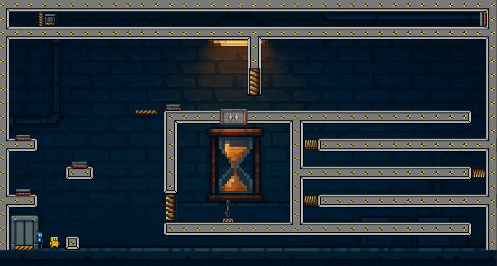
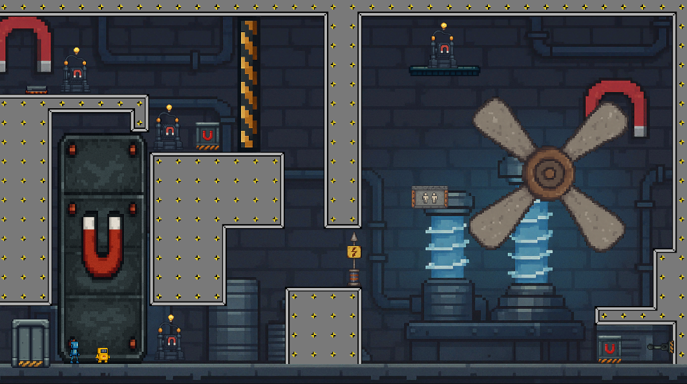
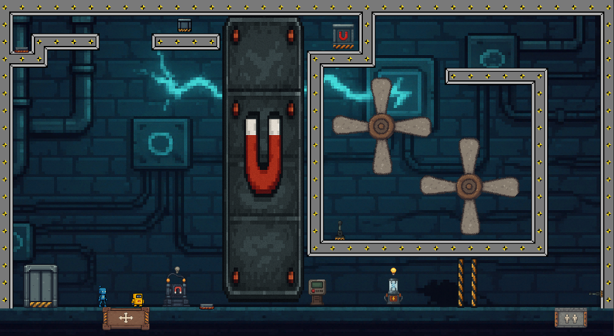
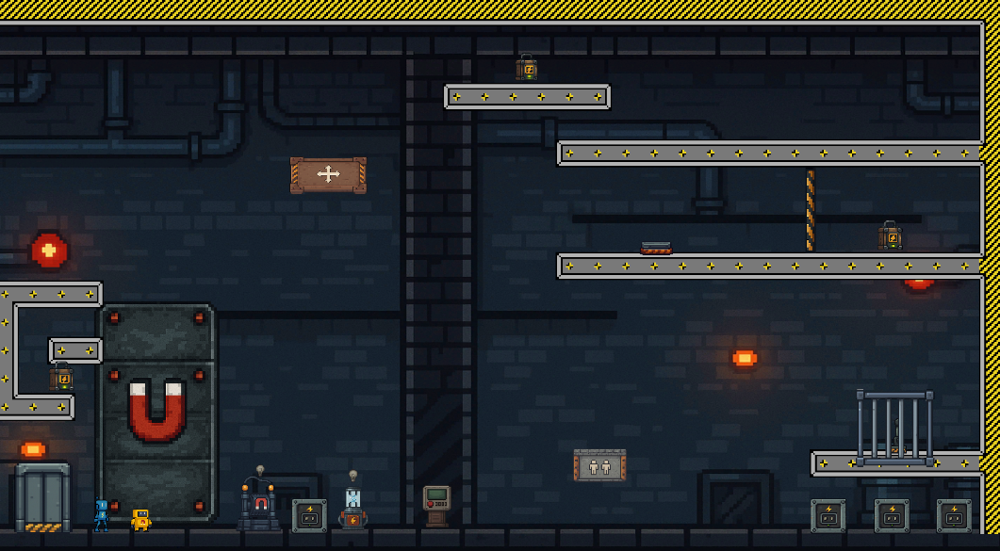

# Rusty Friends Game

Short description
-----------------

This is a Unity game prototype made as my bachelor degree thesis. The repository includes all source assets, scenes.

Rusty Friends is a cooperative puzzle-platformer designed to show that collaboration and communication are essential to overcoming challenges. Players must work together to solve environment-based puzzles, manipulate objects, and navigate obstacles that are impossible to complete alone. The game mechanics, level design, and scripted encounters are intentionally built to reward teamwork and shared problem-solving.

Scenes (detailed)
------------------

Below are the primary scenes, short descriptions, and screenshots. 

- Main Menu

	Entry point for the game — navigation options (Start, Settings, Exit) and branding.

	

- Lobby

	Hub area where players prepare before starting levels. Demonstrates player avatars and environment props.

	

- Level 1 

	

- Level 2 

	

- Level 3

	

- Level 4

	

- Level 5 

	

- Level 6

	